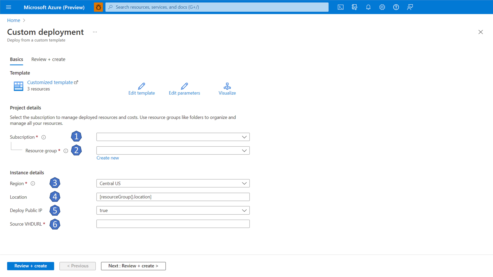
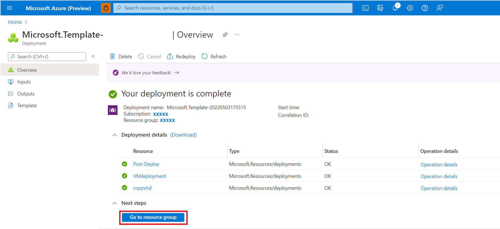
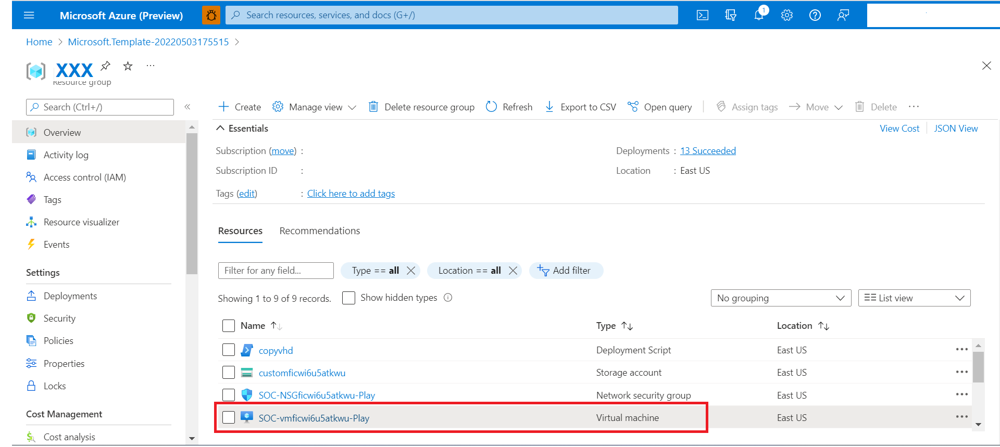
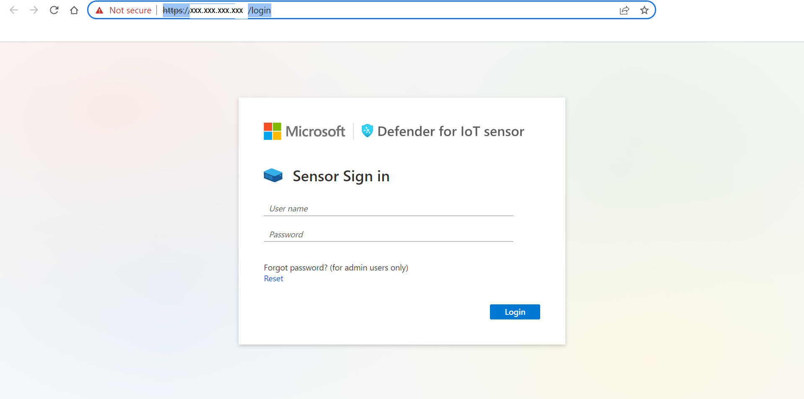
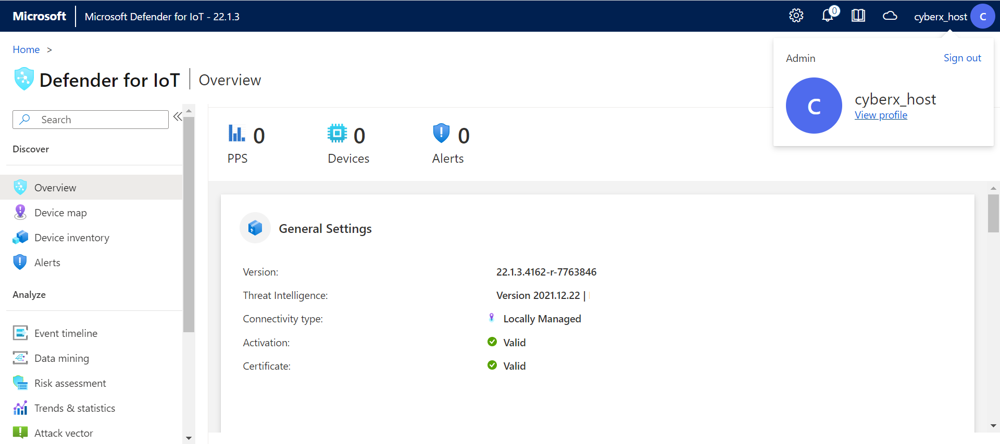
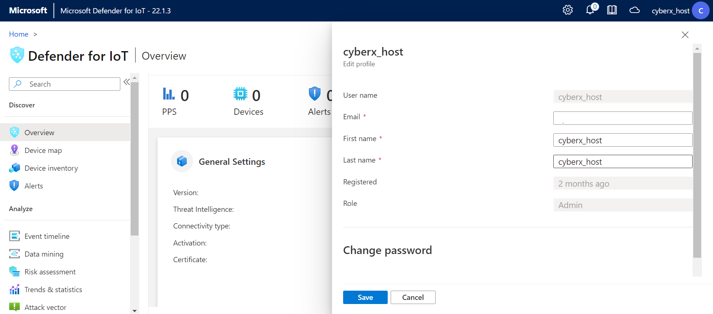
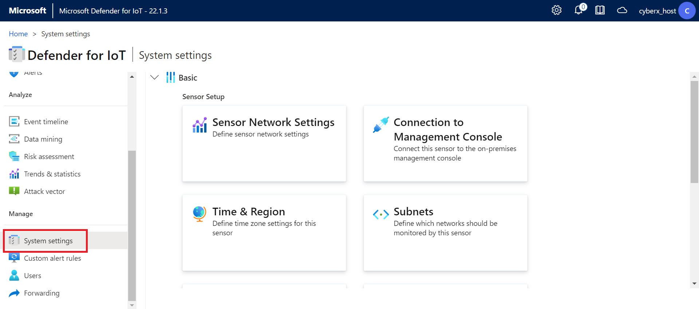
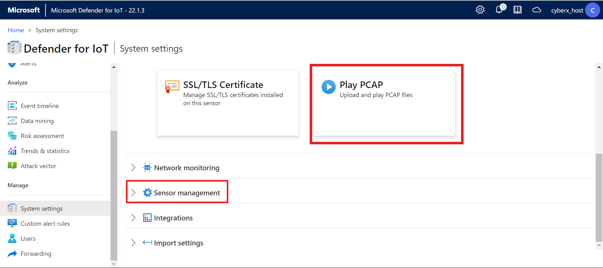
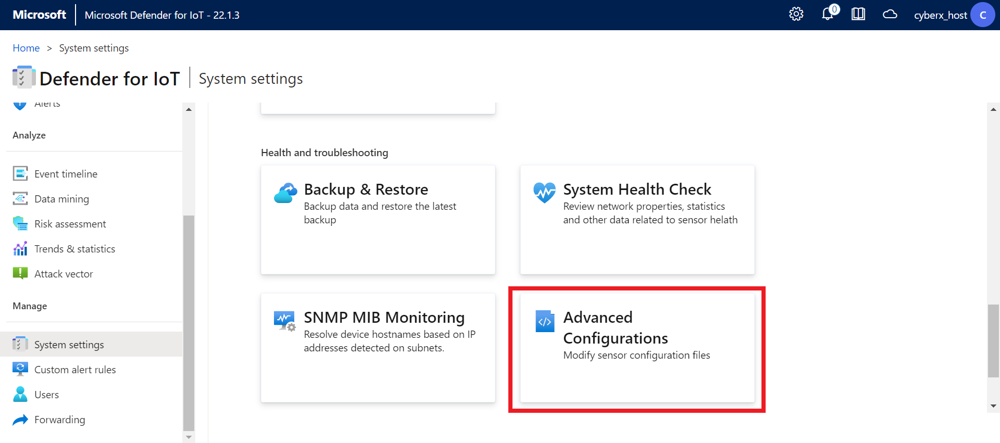
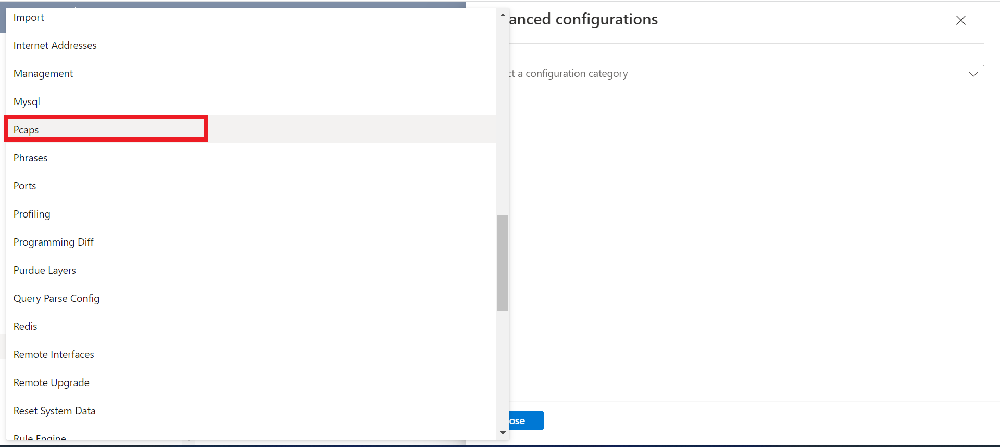

# Installation and Setup

#### ⌛ Estimated time to complete this lab: 20 minutes

## Objectives

This module guides you through the deployment of the Microsoft Defender for IoT Training Lab solution that will be used in all subsequent modules.

#### Prerequisites

To get started with Microsoft Defender for IoT, you must have a Microsoft Azure subscription. If you do not have a subscription, you can sign up for a free account [here](https://azure.microsoft.com/en/free).

Permissions to create a resource group in your Azure subscription.

### Exercise 1: Deploy The Sensor in Azure

In this exercise we will show you how to create a brand new Microsoft Defender for IoT sensor on Azure.

For the deployment, a VHD file is used, the link for the IoT sensor installation is in the email you have received, please copy it now as you will need to paste it in the next step

Please note - This link is private and will expiree in 3 days. 

To Deploy The Sensor VM, click below button to generate a template deployment installation 

Please update the following screen as follow:

1. Please select your Azure subscription to which you would like to deploy the trail service.
2. Please select an existing resource group or create a new one (Use the hyperlink below the box).
	a. We recommend creating a new one to easily identify the relevant resources of the trail service.
3. Please select the Region (Time zone) to which you are deploying the trail service to.
4. Please leave the location box with its default value, no need to change it.
5. The trail service can be available to be used with an external IP that will be accessible from the WWW should choose the public IP option set to "True", otherwise the service will use an internal IP only.
6. Please Paste the link of the VHD copied from the mail recived into this filed.
	a. Please make sure there are o omitted characters or added ones.

Once complete please click on the Review + Create button
Upon validation complition, proceed to click on the Create button to initiate the process.

The process runs for approx. 30 to 60 minutes

A message saying "Your deployment is complete" is the result of a successful deployment.

To proceed to launch the trail version, identify the IP of the service by the Go to resource group button on the bottom.

In the displayed resource list, click on the resource of type - Virtual Machine

In the above image you may identify the IP (If public or private)

Proceed to access the console by using the selected networking method IP (Public or IP) using https:// to proceed the IP
in such a way

Use the user name & password as provided by you MS contact.

Upon successful login please proceed immediately to change the password by clicking on the username on the top right corner and selecting 
View Profile link

And change the password (Scroll down)

### Exercise 2: Enabling the PCAP player

The PCAP player needs to be enabled to be visibly avialble for use in the UI. 
To do so, please select the "System settings" option from the scrolled down left side menu

Scroll all the way down to the bottom to locate if the PCAP Player is enabled (Shown in the image below in the red top squre) or not.
If the PCAP player is not shown, proceed to click on the arrow next to the Sensor Managment button (Shown in the image below in the red lower squre).

From the newly opend menu, scroll down to locate the "Advanced Configuration" option (Shown in the image below in the red squre)

From the opened "Configuration Selection" menu, scroll down to locate the "PCAP" category

Scroll down to locate the "enabled" option, it should be set to 1. if it is not so, chne it now, and click the save button and approv to commit the change.

