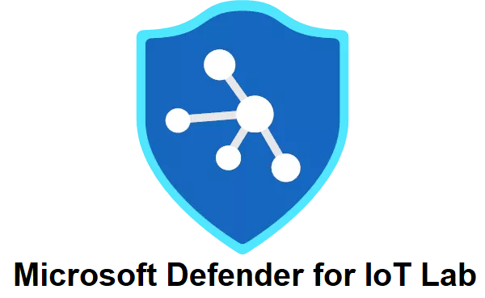

# Welcome to Microsoft Defender for IoT Training Lab

## Introduction
These labs help you get ramped up with Microsoft Defender for IoT and provide hands-on practical experience for product features, capabilities, and scenarios.

The lab deploys a Microsoft Defender for IoT Sensor and provides data (PCAPs) to simulate scenarios that showcase various Microsoft Defender for IoT features. You should expect very little or no cost at all due to the fact that Microsoft Defender for IoT offers a 30-day free trial, so the only cost are of the Azure subscription resources. 

## Prerequisites
To deploy Microsoft Defender for IoT Trainig Lab, **you must have a Microsoft Azure subscription**. If you do not have an existing Azure subscription, you can sign up for a free trial [here](https://azure.microsoft.com/free/).

## Getting started

Before proceeding further please read the [Microsoft CELA Term and Conditions](https://github.com/Contoso-Hotels-Security/DefenderForIOT/blob/main/DeploySensorV22/Modules/CELA%20Conditions.md) before using the service. Continuoing byond this point is your acknoledgment and approval of these terms.

Below you can see all the [Resources](#Modules) that are part of this lab. Although in general they can be completed in any order, you must start with [Installation & Setup](./DeploySensorV22/Modules/Module-1-Setting-up-the-environment.md) as this deploys the lab environment itself.

* [Installation & Setup](./DeploySensorV22/Modules/Module-1-Setting-up-the-environment.md)
* [Product Review](https://azure.microsoft.com/en-us/services/iot-defender/)
* [Setting Up Your Network](https://docs.microsoft.com/en-us/azure/defender-for-iot/organizations/how-to-set-up-your-network)
* [SPAN Port Illustration](https://docs.microsoft.com/en-us/azure/defender-for-iot/organizations/plan-network-monitoring?msclkid=92a4b61cd13e11ecbc324f18968e7035&tabs=switch-span-port#understand-your-network-architecture)
* [Demo](https://www.youtube.com/watch?v=JVpgUlHblk0)

* [PCAPs](https://github.com/Contoso-Hotels-Security/DefenderForIOT/blob/main/DeploySensorV22/PCAPs/holpcaps.zip) for your use to simulate traffic
